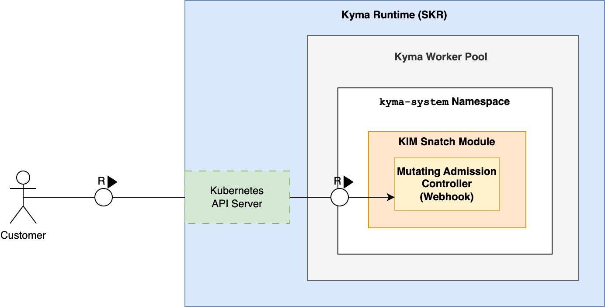

# KIM Snatch Module

## Overview
The KIM Snatch module is part of Kyma Infrastructure Manager's (KIM) worker pool feature. It is a mandatory Kyma module deployed on all Kyma-managed runtimes. Mandatory modules are not visible for  SAP BTP, Kyma runtime customers and automatically installed by the [KLM](https://github.com/kyma-project/lifecycle-manager) on each SAP BTP, Kyma runtime.

In the past, only one worker pool existed in a Kyma runtime (called "Kyma worker pool"). This Kyma worker pool is mandatory and cannot be removed. It allows several configuration options, which can be too limited for users requiring special node setups.

With the Kyma worker pool feature, you can add customized worker pools to your Kyma runtime and introduce worker nodes optimized for your particular workload requirements. 

The KIM-Snatch module assigns Kyma workloads, for example, Kyma modules' operators, to the Kyma worker pool and ensures that your worker pools are reserved for your workloads. This solution has the following advantages:

* Kyma workloads are not allocating resources on customized worker pools. This ensures that customers have the full capacity of the worker pool available for their workloads.
* It reduces the risk of incompatibility between Kyma container images and individually configured worker pools.

## Technical Approach

The KIM-Snatch module introduces the Kubernetes [mutating admission webhook](https://kubernetes.io/docs/reference/access-authn-authz/admission-controllers/#mutatingadmissionwebhook).

It intercepts all Pods that are scheduled in a Kyma-managed namespace. [Kyma Lifecycle Manager (KLM)](https://github.com/kyma-project/lifecycle-manager) always labels a managed namespace with `operator.kyma-project.io/managed-by: kyma`. KIM reacts only to Pods scheduled in one of these labeled namespaces. Typical Kyma-managed namespaces are `kyma-system` or, if the Kyma Istio module is used,  `istio`.

Before the Pod is handed over to the Kubernetes scheduler, KIM-Snatch adds [`nodeAffinity`](https://kubernetes.io/docs/concepts/scheduling-eviction/assign-pod-node/#node-affinity) to the Pod's manifest. This informs the Kubernetes scheduler to prefer nodes within the Kyma worker pool for this Pod. 

## Limitations

### Using the Kyma Worker Pool is not Enforced
Assigning a Pod to a specific worker pool can have the following drawbacks:

* Resources of the preferred worker pool are exhausted, while other worker pools still have free capacities.
* If no suitable worker pool can be found and the node affinity is set as a "hard" rule, the Pod is not scheduled.

To overcome these limitations, we use `preferredDuringSchedulingIgnoredDuringExecution` so that the configured node affinity on Kyma workloads is a "soft" rule. For more details, see the [Kubernetes documentation](https://kubernetes.io/docs/concepts/scheduling-eviction/assign-pod-node/#node-affinity)). The Kubernetes scheduler prefers the Kyma worker pool. Still, if scheduling the Pod in this pool is impossible, it also considers other worker pools.

### Kyma workloads are not Intercepted

#### Non-Available Webhook is Ignored by Kubernetes
Kubernetes calls can be heavily impacted if a mandatory admission webhook isn't responsive enough. This can lead to timeouts and massive performance degradation.

To prevent such side effects, the KIM-Snatch webhook is configured with a [failure tolerating policy](https://kubernetes.io/docs/reference/access-authn-authz/extensible-admission-controllers/#failure-policy), which allows Kubernetes to continue in case of errors. This implies that downtimes or failures of the webhook are accepted, and Pods get scheduled without `nodeAffinity`.

#### Already Scheduled Pods are Ignored by Webhook
Additionally, no Pods that are already scheduled and running on a worker node receive `nodeAffinity` because `nodeAffinity` is only allowed to intercept non-scheduled Pods. This means that running Pods must be restarted to receive `nodeAffinity`. This webhook does not restart running Pods to avoid service interruptions or reduced user experience.